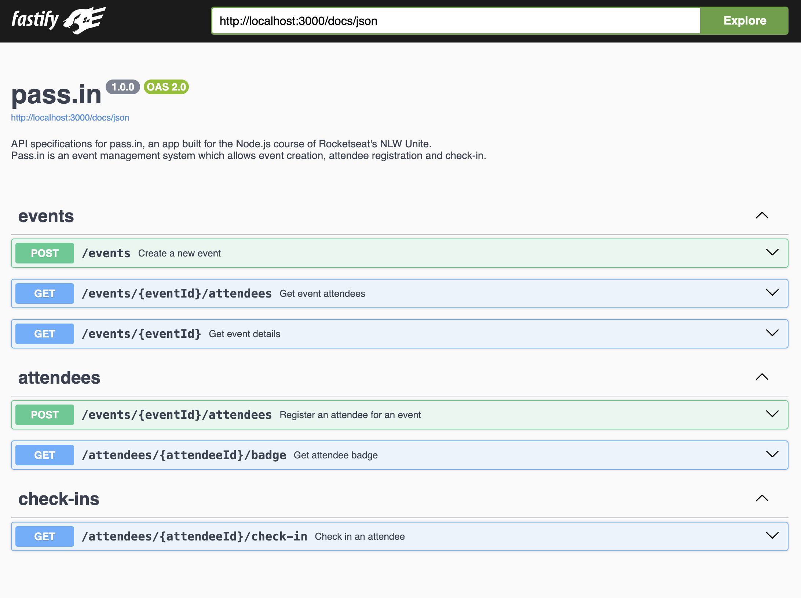

# pass.in

pass.in is an application for **managing participants in in-person events**.    

It was built during Rocketseat's NLW Unite event.

The tool allows the organizer to register an event and open a public registration page.

Registered participants can generate a credential for check-in on the day of the event.

The system will scan the participant's credential to allow entry to the event.

## Requirements

### Functional Requirements

- [x] The organizer must be able to register a new event;
- [x] The organizer must be able to view event data;
- [x] The organizer must be able to view the list of participants;
- [x] The participant must be able to register for an event;
- [x] The participant must be able to view their registration badge;
- [x] The participant must be able to check-in at the event;

### Business Rules

- [x] Participants can only register for an event once;
- [x] Participants can only register for events with available slots;
- [x] Participants can only check-in at an event once;

### Non-functional Requirements

- [x] Event check-in will be done via a QR Code;

## Tech Requirements

To run this project, you need:

- Node.js installed on your machine

## Commands

To make development easier, we have provided some commands you can run from your terminal. Here's what each of them does:

- `npm run dev`: This command starts a development server, allowing you to work on your project. It watches for changes in your files and automatically restarts the server when needed.
  
- `npm run build`: When you're ready to deploy your application, use this command to build your project. It compiles your TypeScript code into a format suitable for deployment.

- `npm start`: Once your project is built, you can start the server using this command. It runs the compiled code from the `dist` directory.

- `npm run db:migrate`: This command runs database migrations, ensuring that your database schema is up-to-date with your code changes.

- `npm run db:studio`: If you need to visually inspect your database or make changes to your data, use this command to open Prisma Studio, a graphical interface for managing your database.

## API Documentation (Swagger)

Once the API is running, you can access detailed documentation at [http://localhost:3000/docs](http://localhost:3000/docs).



## Database

This application will use a relational database (SQL). For development environment, we will proceed with SQLite for its ease of setup.

### Database structure

```sql
-- CreateTable
CREATE TABLE "events" (
    "id" TEXT NOT NULL PRIMARY KEY,
    "title" TEXT NOT NULL,
    "details" TEXT,
    "slug" TEXT NOT NULL,
    "maximum_attendees" INTEGER
);

-- CreateTable
CREATE TABLE "attendees" (
    "id" INTEGER NOT NULL PRIMARY KEY AUTOINCREMENT,
    "name" TEXT NOT NULL,
    "email" TEXT NOT NULL,
    "created_at" DATETIME NOT NULL DEFAULT CURRENT_TIMESTAMP,
    "event_id" TEXT NOT NULL,
    CONSTRAINT "attendees_event_id_fkey" FOREIGN KEY ("event_id") REFERENCES "events" ("id") ON DELETE CASCADE ON UPDATE CASCADE
);

-- CreateTable
CREATE TABLE "check_ins" (
    "id" INTEGER NOT NULL PRIMARY KEY AUTOINCREMENT,
    "created_at" DATETIME NOT NULL DEFAULT CURRENT_TIMESTAMP,
    "attendee_id" INTEGER NOT NULL,
    CONSTRAINT "check_ins_attendee_id_fkey" FOREIGN KEY ("attendee_id") REFERENCES "attendees" ("id") ON DELETE CASCADE ON UPDATE CASCADE
);

-- CreateIndex
CREATE UNIQUE INDEX "events_slug_key" ON "events"("slug");

-- CreateIndex
CREATE UNIQUE INDEX "attendees_event_id_email_key" ON "attendees"("event_id", "email");

-- CreateIndex
CREATE UNIQUE INDEX "check_ins_attendee_id_key" ON "check_ins"("attendee_id");

```

## Tech Stack

- Backend: Node.js with Typescript and Fastify
- Database: Prisma
